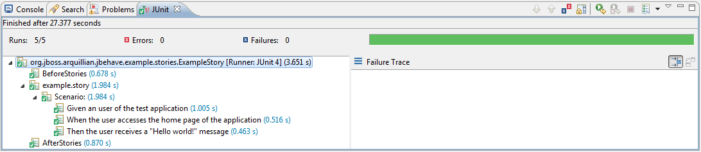

arquillian-jbehave-example
==========================

Example for the arquillian-jbehave integration project

Steps to use this project and get started with the arquillian-jbehave extended integration:

1.Checkout from github the following dependencies of this example: 
  1.1 https://github.com/andreiserea/jbehave-core/tree/jbehave-3.8-arquillian
  This is a branch of jbehave-3.8 with some addons required for the integration with arquillian to work smoothly  
  1.2 https://github.com/andreiserea/jbehave-junit-runner
  This provides a better feedback from JUnit when running stories -step granularity (you'll see a tree-like structure in JUnit with stories as parents and scenarios with steps as children) 
  1.3 https://github.com/andreiserea/arquillian-jbehave
  Most important dependency, it includes the Arquillian-Jbehave JUnit runner class along with some small extensions. 
2.Import the Maven project in your favorite IDE. Of course, you can run the tests from maven but you won't get the nice visual diagram of the scenarios and their steps. 
3.Run the ExampleStory.java class a JUnit Test case. This will deploy the small TestService class with required resources (story file) and will run the test inside arquillian. 
 
Important things to notice: 
1. The @RunWith annotation with ArquillianJbehaveRunner. 
2. The @StoryFile annotation which specifies the path to the story file, without the .story extension. The story file locator based on this annotation is AnnotationStoryPathResolver, which you can configure with a default extension and a default stories folder. In this case, the default folder is "stories"
3. The @Deployment for Arquillian adds, among the required test classes, the org.jboss.arquillian:arquillian-jbehave:jar:1.0.0 maven artifact, required to run JBehave related code in the container.  It also adds the "stories" folder as a resource. 
But one of the most important things the deployment contains is the class named:
"org.jboss.arquillian.jbehave.example.stories.ExampleStoryCopycatMerge". Notice that it is the same name as the test class, with "CopycatMerge" appended to it. Why? 
Well...you know that Arquillian redeploys after each test class, which has a big negative impact on the time required to run the tests. Also, this integration treats all methods in all steps instances as individual tests (methods are annotated with @Test). So, to prevent redeployment when running multiple stories with multiple steps instances, the Arquillian Jbehave runner creates a class at runtime in which it copies ALL methods from ALL steps classes, names it using the pattern explained above and gives that to Arquillian for testing. 
So, although you are running multiple stories in multiple test classes, for Arquillian in the end it is just ONE. 
4. Notice the ArquillianInstanceStepsFactory used to provide the steps classes. It is used to provide dependency injection in the steps classes (yes, you can @EJB in step classes but you HAVE TO specify beanName value for the annotation).  
5. The steps instances are static instances! This is because Arquillian would otherwise instantiate the steps classes each time a step has to run and you wouldn't have any "state" across a scenario.  

That's the short story of the example. For more info read the readme for arquillian-jbehave integration project on github (https://github.com/andreiserea/arquillian-jbehave) or contact me directly. 
